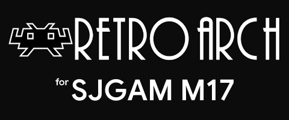

# RetroArch Buildroot для SJGAM M17 (W12-V04) (Релиз - версия 1.0)
РАБОТА ГАРАНТИРОВАНА ТОЛЬКО НА W12-V04 РЕВИЗИИ! Я НЕ НЕСУ ОТВЕТСТВЕННОСТИ ЗА ВАШИ ДЕЙСТВИЯ!
Возможна работа на ревизии W12-V03 (other-gpio-rgb).
Ещё хотелось бы сказать о том, что прошивки я в первую очередь делаю для себя и под ваши Наполеонские просьбы подстраиваться не буду. Фиксить баги, разумеется, по возможности, буду.

## Введение
Представляю вам - RetroArch Buildroot.
Абсолютно чистый RetroArch 1.15.0 (6.6.16b80) на Buildroot основе (за основу взят китайский Buildroot от консоли W12-V04).

## Проделанные работы
- Buildroot был на 100% вычищен от китайского хлама.
- Были добавлены некоторые библиотеки.
- Была переписана логика запуска.
- Был добавлен ADB.
- Была сделана переразметка eMMC.
- Был изменен логотип запуска.
- Полностью настроен конфиг (если хотите, можете и сами перенастроить).
- Много чего ещё :)

Цель прошивки - освободить консольку от SD карты. Все игры вы можете хранить на единственном разделе для изменения - userdata. Там и хранится RetroArch (с пятью ядрами NES, SNES, GB/GBC/GBA, Sega MD/MS/CD/32X собранные специально под ARMhf на первое время), который занимает места. В итоге, на игры остается 3.7 гигабайта (вы также можете добавить и свои ядра). Работа с SD картой не была вырезана, она также монтируется, и вы можете запускать игры с неё.

**ВНИМАНИЕ - запуск em_ui.sh и прочих систем с SD карты вырезан полностью, даже не пытайтесь.**

## Структура встроенной памяти eMMC в прошивке:
| № | Раздел | Смещение (LBA) | Размер (HEX) | Размер (МБ) | Описание |
|:---:|:--- |:---:|:---:|:---:|:--- |
| 01 | **uboot** | `0x00004000` | `0x00002000` | **4 MB** | u-boot раздел |
| 02 | **trust** | `0x00006000` | `0x00002000` | **4 MB** | trust раздел |
| 03 | **boot** | `0x00008000` | `0x00002800` | **5 MB** | boot раздел |
| 04 | **rootfs** | `0x0000A800` | `0x00010000` | **32 MB** | Системный раздел Buildroot |
| 05 | **userdata** | `0x0001A800` | `0x00745800` | **3722.9 MB** | Игры, RetroArch и прочее |

## Неудобства
- При попытке поиска в RetroArch на окне ввода RetroArch зависает (что-то с разметкой кнопок в device-tree).
- Невозможно менять яркость подсветки.
- Нет возможности использовать наушники (Пока что нет возможности грамотной реализации).
- Не работают стики (не сильно они и нужны).
